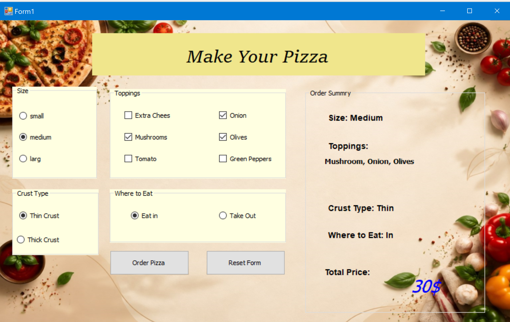
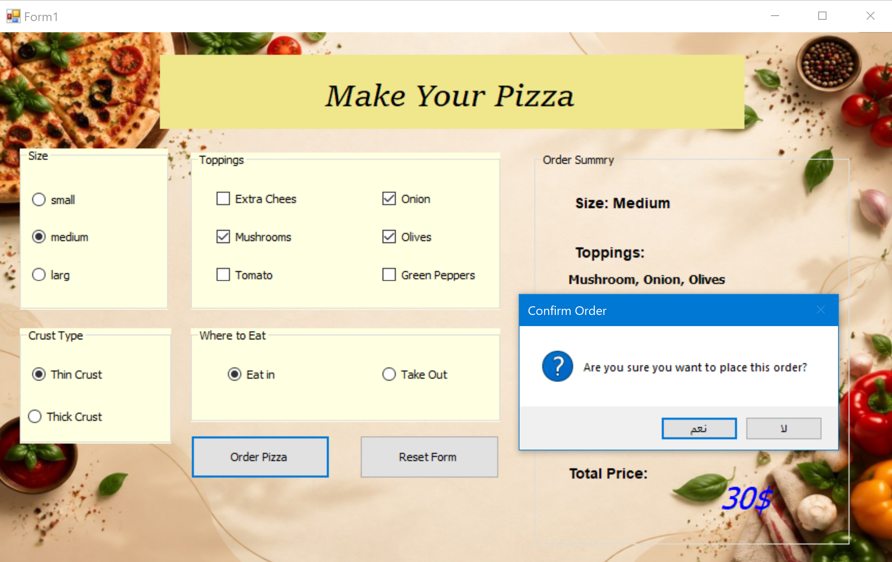

# Make Your Pizza

A desktop application developed in **C#** using **Windows Forms** that simulates an interactive pizza ordering system with real-time cost calculation and instant order summaries.

Developed by **Yousif Aljaberi**

---

## Table of Contents

* [Overview](#overview)
* [Screenshots](#screenshots)
* [Features](#features)
* [Technologies](#technologies)
* [Getting Started](#getting-started)
* [Technical Highlights](#technical-highlights)
* [Author](#author)

---

## Overview

This application allows users to build and customize a pizza by choosing crust thickness, size, dining location, and multiple toppings. The system updates the total summary on every selection change, confirms the order, and handles resetting or locking controls.

---

## Screenshots

| Pizza Customizer | Order Confirmation |
| :---: | :---: |
|  |  |

---

## Features

* **Customization Choices:**
  * Size selection (Small, Medium, Large)
  * Crust type selection (Thin, Thick)
  * Toppings selection (Extra Cheese, Mushrooms, Tomatoes, Onions, Olives, Green Peppers)
  * Dining preference (Eat In, Take Out)
* **Real-Time Updates:** Dynamic calculation that updates the summary and price instantly upon any click.
* **Order Flow:** Confirmation dialog before submission, with automatic locking of inputs once the order is placed.
* **Form Reset:** Restores default settings and unlocks input controls for a new order.

---

## Technologies

* **Language:** C#
* **Framework:** Windows Forms (.NET)
* **IDE:** Visual Studio

---

## Getting Started

1. Clone the repository:
   ```bash
   git clone https://github.com/Yousef-Aljaberi/Make-Your-Pizza.git

```

2. Open the solution file (`.sln`) in **Visual Studio**.
3. Press `F5` to build and run the application.

---

## Technical Highlights

* Event-driven programming with Windows Forms UI controls.
* Iterating through control hierarchies dynamically (`GroupBox.Controls`).
* Passing custom data via the control `Tag` property.
* Dynamic text formatting and comma handling for order items.
* State management to enable/disable UI controls dynamically.

---

## Author

**Yousif Aljaberi**

* **GitHub:** [Yousef-Aljaberi](https://github.com/Yousef-Aljaberi?utm_source=gemini)
* **LinkedIn:** [Yousif Aljaberi](https://www.linkedin.com/in/yousif-aljaberi-004278408/?utm_source=gemini)

